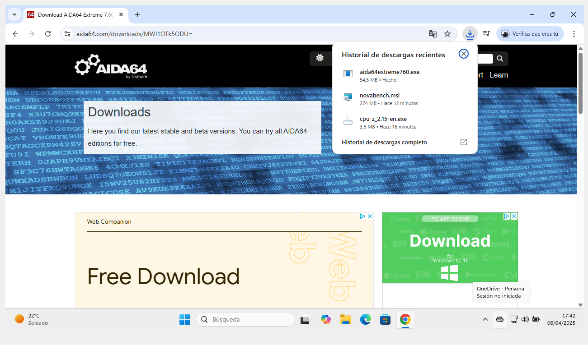
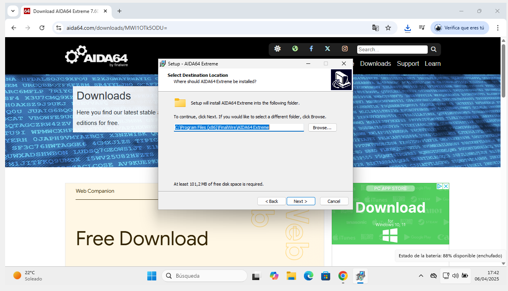
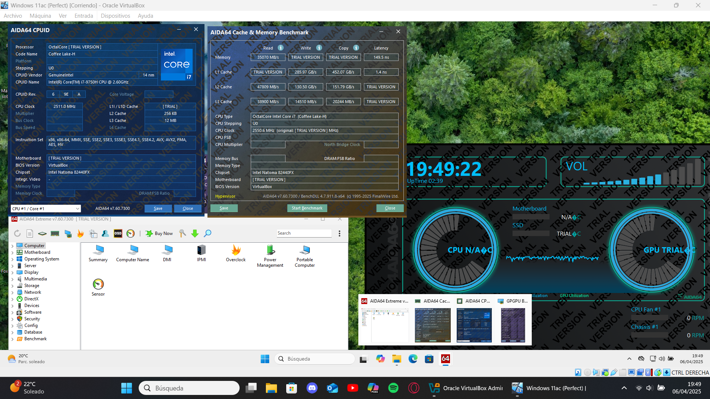

# Guía Rápida de AIDA64  

## Introducción  
AIDA64 es una herramienta de diagnóstico y benchmarking para hardware, ideal para analizar el rendimiento de CPU, RAM, GPU y discos.  

Diagnóstico profundo: Revela especificaciones ocultas de tu sistema (voltajes, latencias de RAM, modelo exacto de placa base).
Pruebas de estabilidad: Ideal para validar overclocking mediante stress tests personalizables (CPU, FPU, caché, RAM).
Monitorización en tiempo real: Crea informes personalizados con sensores de temperatura (útil para detectar throttling).

## Descarga e Instalación  
1. **Descarga**:  
   - Visita [www.aida64.com/downloads](https://www.aida64.com/downloads).  
   - Elige la versión "AIDA64 Extreme" (gratuita para 30 días).  
     

2. **Instalación**:  
   - Ejecuta el instalador y sigue los pasos. No requiere configuración adicional.  
     

## Uso Básico  
1. **Prueba de estrés**:  
   - Abre AIDA64 > Herramientas > "Prueba de estabilidad del sistema".  
   - Selecciona los componentes a testear (ej: CPU, RAM) y haz clic en "Start".  
     

2. **Interpretación de resultados**:  
   - Monitorea temperaturas y frecuencias en tiempo real. Si hay errores o sobrecalentamiento, se indicará en rojo.  
