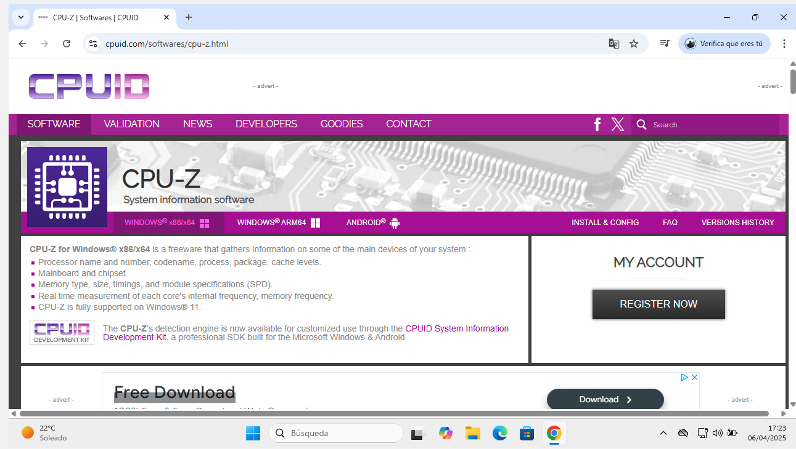
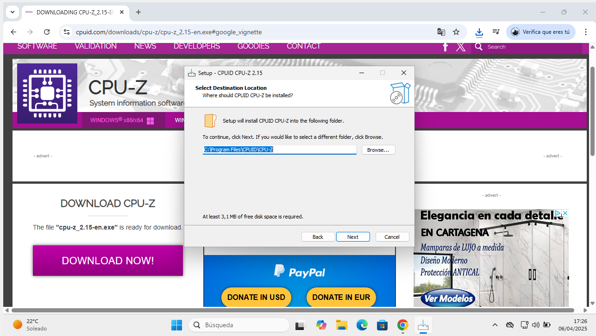
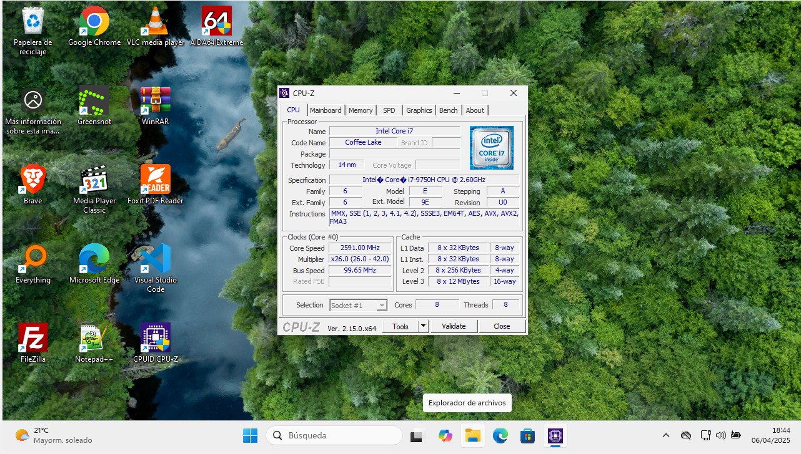
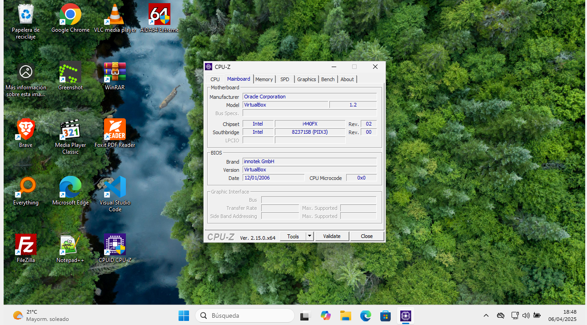
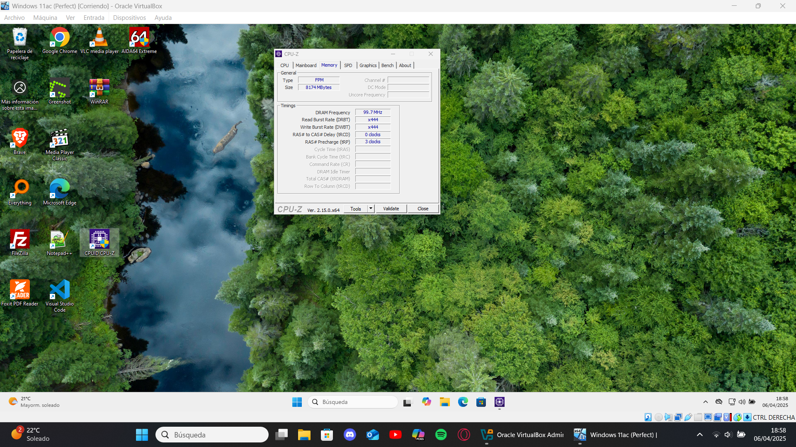

# Guía Rápida de CPU-Z  

## Introducción  
CPU-Z muestra información detallada del hardware: modelo de CPU, caché, placa base, memoria y GPU.  
Identificación precisa: Detecta el stepping de tu CPU (revisión de silicio) y timings reales de la RAM (no solo los anunciados por el fabricante).
Validación de configuraciones: Compara la velocidad de reloj base vs. turbo boost en diferentes núcleos.
Compatibilidad: Cruza datos con la base de datos de placas base para ver soporte oficial de memorias RAM.

## Descarga e Instalación  
1. **Descarga**:  
   - Ve a [cpuid.com/softwares/cpu-z.html](https://www.cpuid.com/softwares/cpu-z.html).  
   - Descarga la versión portable (no requiere instalación) o el exe.  
     
    

2. **Ejecución**:  
   - Descomprime el ZIP y abre `cpuz.exe`.  

## Uso Básico  
1. **Información clave**:  
   - Revisa las pestañas "CPU", "Memory" y "Graphics" para ver especificaciones técnicas.  
     
 
 

2. **Benchmark**:  
   - Ve a la pestaña "Bench" > "Stress CPU" para probar rendimiento.  
   - Compara tu puntuación con CPUs similares.  
   
