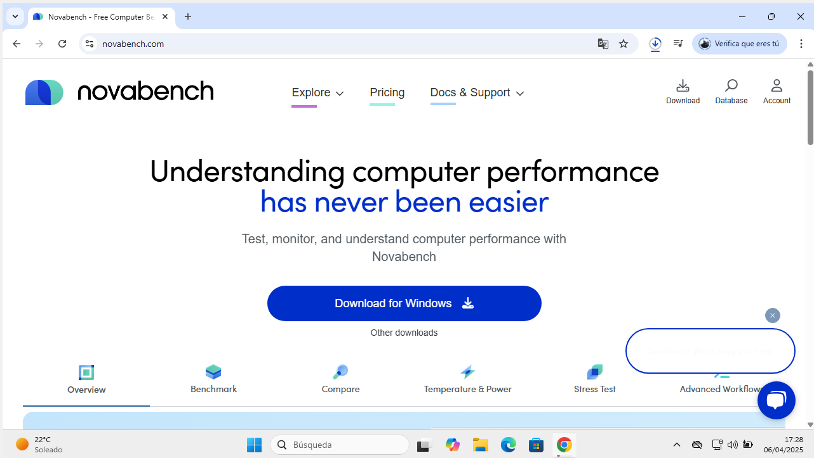
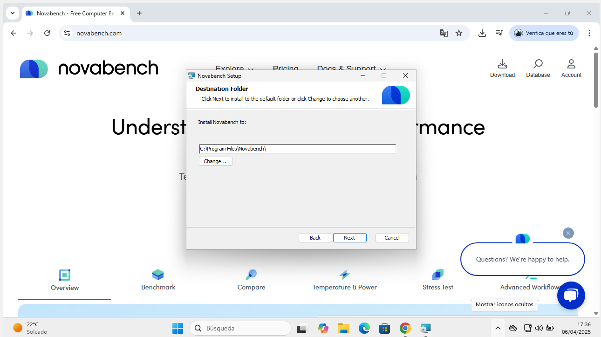
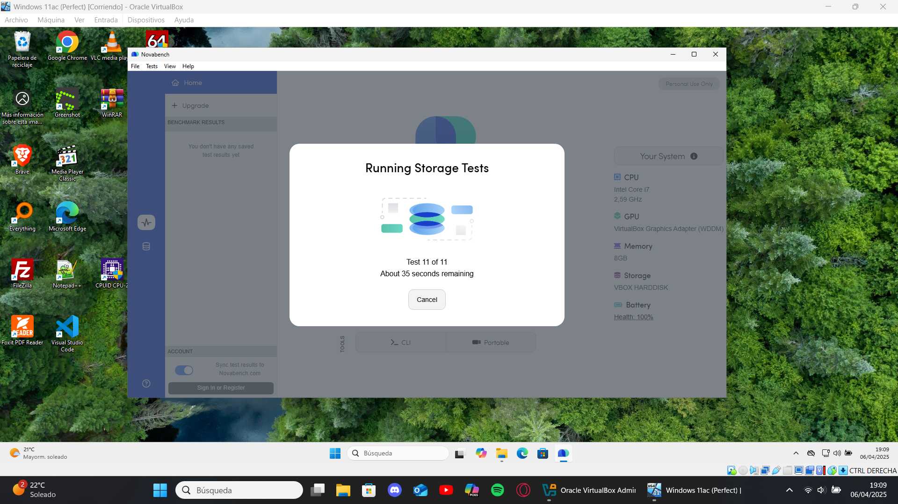
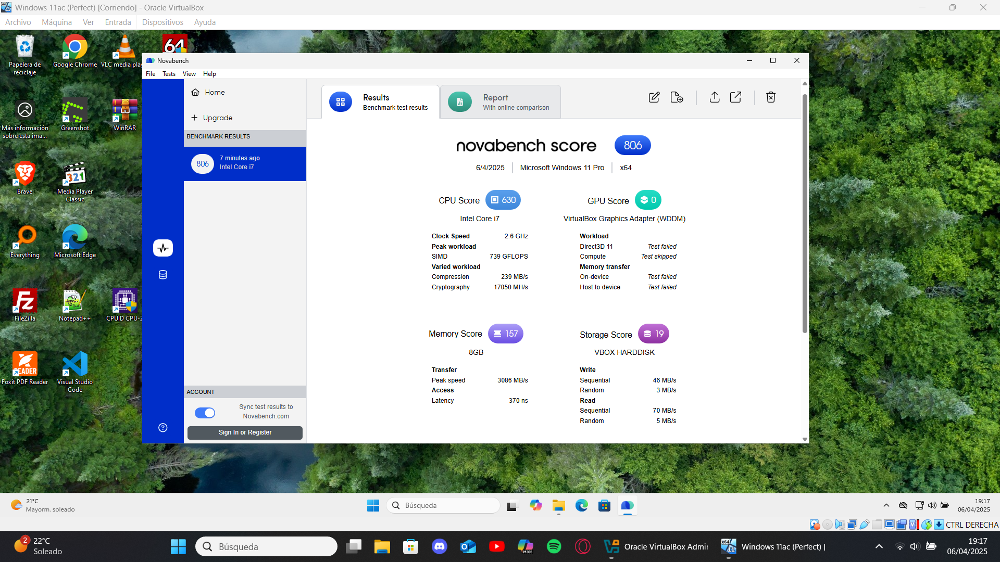

# Guía Rápida de NovaBench  

## Introducción  
NovaBench realiza benchmarks rápidos de CPU, GPU, RAM y almacenamiento, generando una puntuación global.  

## Descarga e Instalación  
1. **Descarga**:  
   - Entra a [novabench.com/download](https://novabench.com/download).  
   - Elige la versión gratuita.  
     

2. **Instalación**:  
   - Ejecuta el instalador y acepta los términos.
      

## Uso Básico  
1. **Ejecutar prueba**:  
   - Haz clic en "Start Benchmark" y espera 1-2 minutos.  
     

2. **Resultados**:  
   - La puntuación total se compara con otros sistemas. Revisa detalles por componente.  
     
