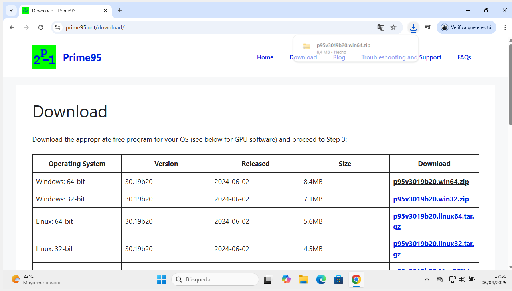
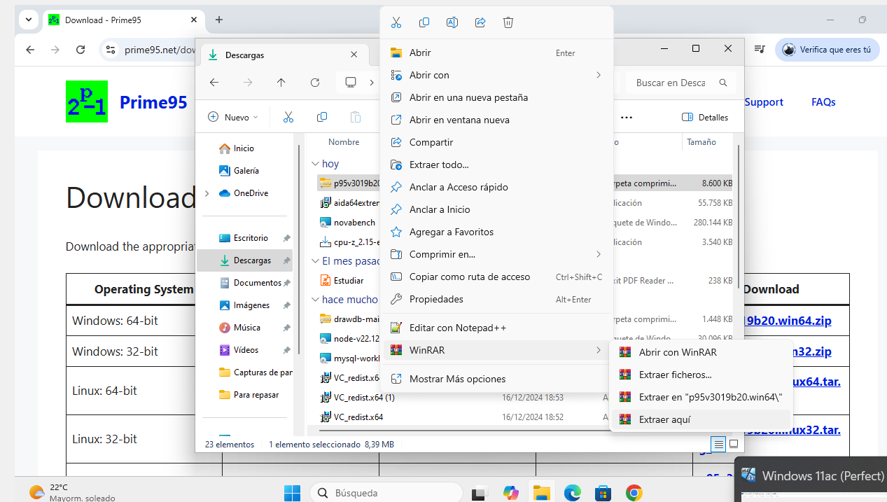
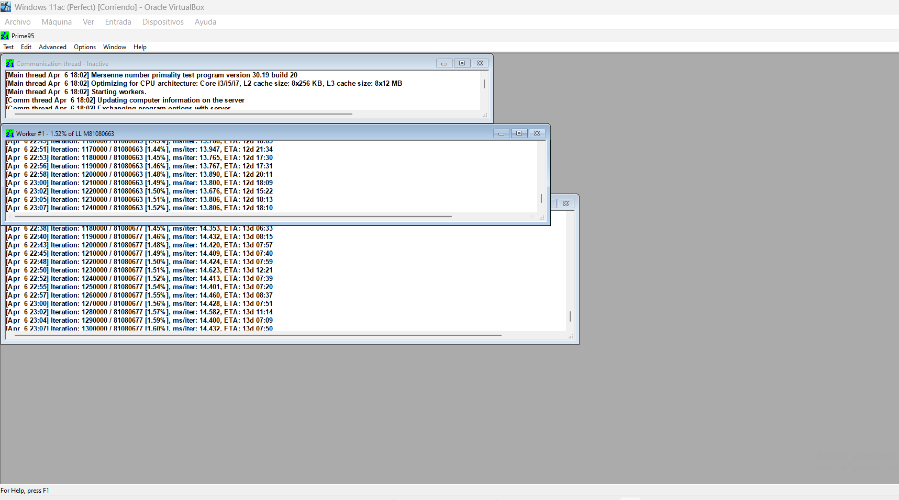

# Guía Rápida de Prime95  

## Introducción  
Prime95 es una herramienta de estrés para CPU, usada para testear estabilidad y detectar errores en overclocking.

Detectar errores silenciosos: Usa algoritmos matemáticos que colapsan CPUs inestables en minutos (incluso si pasan otros benchmarks).

Modos especializados:
Small FFTs: Máxima carga térmica en la CPU.
Blend Test: Combina estrés en CPU y RAM (ideal para sistemas con overclocking en ambos).
Comunidad científica: Los datos de errores ayudan a investigar fallos en arquitecturas de procesadores.

## Descarga e Instalación  
1. **Descarga**:  
   - Visita [www.mersenne.org/download](https://www.mersenne.org/download/).  
   - Descarga la versión para tu sistema operativo.  
     

2. **Ejecución**:  
   - Descomprime el ZIP y abre `prime95.exe`. No requiere instalación.  
    

## Uso Básico  
1. **Prueba de estrés**:  
   - Selecciona "Just Stress Testing" > "Blend Test" (prueba CPU y RAM).  
     

2. **Monitoreo**:  
   - Si hay errores, aparecerán en la ventana. Usa HWMonitor para ver temperaturas.  
